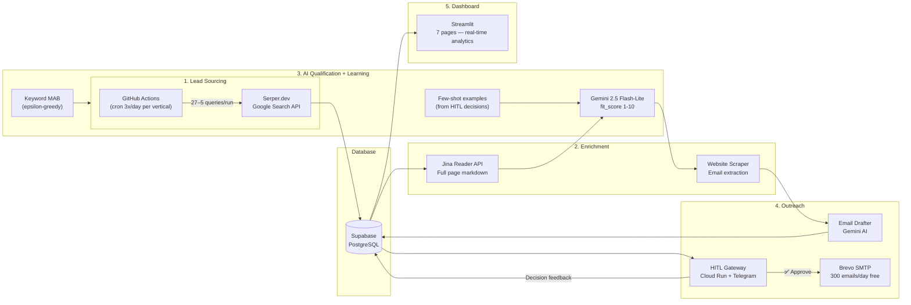
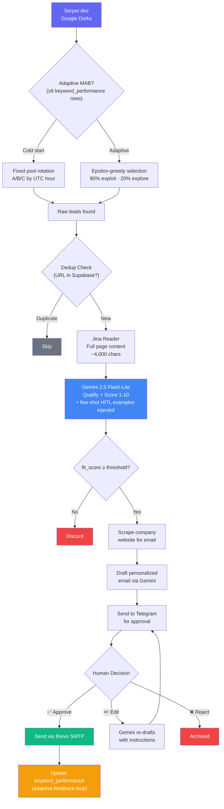
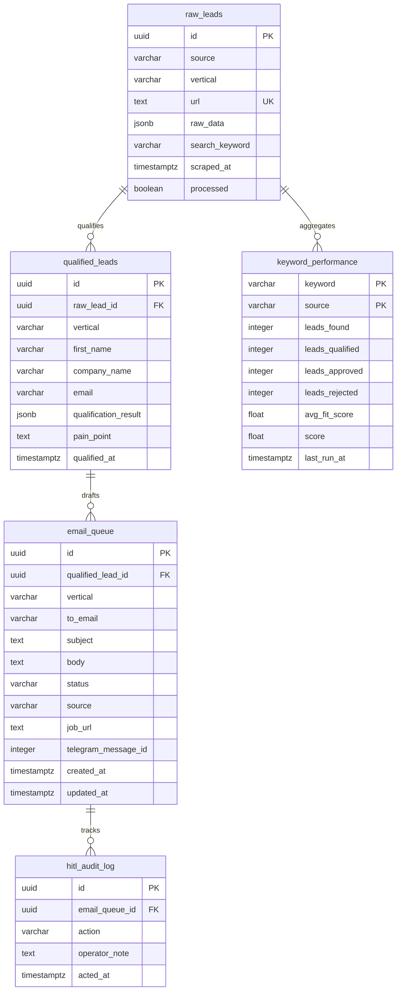

# Autonomous B2B Prospecting Agent

**Fully automated lead generation, qualification, and outreach — 5 active verticals, ~$0.50/month operational cost.**

An AI-powered prospecting system that autonomously discovers leads across multiple B2B markets, enriches them with full-page content analysis, qualifies via LLM scoring with adaptive feedback loops, drafts hyper-personalized cold emails, and routes them through a human-in-the-loop (HITL) approval flow via Telegram — all running on free-tier infrastructure.

[](https://python.org)
[](https://ai.google.dev)
[](https://supabase.com)
[](https://streamlit.io)
[](https://cloud.google.com/run)

---

## Active Verticals

| # | Vertical | Target | Source | Cron | Budget |
|---|---|---|---|---|---|
| **V1** | Tech Services | Freelance job postings (Upwork, LinkedIn, 6 more) | Serper Google Dorks | `5 */8 * * *` | ~2,430 queries/mo |
| **V2** | Cerrieta — Luxury Pet | Pet boutiques, interior designers (Google Maps + IG) | Serper + Places API | Manual | ~300 queries/mo |
| **V3** | HMLV Manufacturers | Custom manufacturers (trade show, marine, millwork, crating, metal) | Serper Google Dorks | Manual | 450 queries/mo |
| **V4** | LGaaS Prospects | Boutique consulting firms (Fractional CFO, M&A, CMMC, AI, ESG) | Serper Google Dorks | `25 */8 * * *` | 450 queries/mo |
| **V5** | M&A Silver Tsunami | Traditional Florida business owners (HVAC, manufacturing, legacy SaaS) near succession | Serper Google Dorks | Manual | ~360 queries/mo |

---

## Architecture



## Pipeline Flow



---

## Key Features

### Multi-Vertical Architecture
- **5 independent pipelines** sharing infrastructure (Supabase, Gemini, Jina, HITL Gateway)
- Each vertical targets a distinct ICP: freelance clients, B2C boutiques, B2B manufacturers, consulting firms, M&A acquisition targets
- All filtered through the same `vertical` column in the database — zero schema duplication
- Per-vertical `SERPER_API_KEY_Vn` support for budget isolation

### Adaptive Keyword Selection (MAB)
- **Epsilon-greedy multi-armed bandit** (ε = 0.20) replaces fixed keyword rotation after ≥6 runs
- `keyword_performance` table tracks `leads_found`, `leads_qualified`, `leads_approved`, `avg_fit_score` per keyword
- Score formula: `0.4 × approval_rate + 0.3 × qual_rate + 0.2 × norm_fit_score + 0.1`
- 80% of queries go to top-performing keywords; 20% explore new ones — continuous self-improvement

### Few-Shot Learning from HITL Decisions
- Before each pipeline run, fetches the 10 most recent Telegram approve/reject decisions
- Injects them into the Gemini system prompt as calibration examples
- Qualifier automatically mirrors the operator's taste over time — no manual prompt tuning required

### Content Enrichment
- **Jina Reader API** converts any URL into clean markdown (~4,000 chars) for deep LLM qualification
- **Company website scraping** discovers email addresses via `mailto:` links and regex
- **Best-effort design**: enrichment failures never block the pipeline — graceful degradation to snippet

### Human-in-the-Loop (HITL)
- **Telegram bot** sends each email draft with Approve / Edit / Reject / Investigate inline buttons
- Edit flow: operator sends natural language → Gemini re-drafts instantly
- **Dashboard alternative**: approve/reject directly from the Streamlit web UI
- Full `hitl_audit_log` trail for every decision

### Real-Time Dashboard (7 pages)
| Page | Content |
|---|---|
| Overview | Global KPIs, cross-vertical funnel, daily trends |
| Leads | Filterable table with qualification details |
| Email Queue | HITL approve/reject from browser |
| Analytics | Source performance, keyword MAB scores, top/bottom keywords |
| Architecture | System diagram and flow reference |
| HMLV Manufacturers | V3 pipeline: industry cards, flag analysis, dork performance |
| LGaaS Prospects | V4 pipeline: niche breakdown, firm profiles, outreach queue |

---

## Tech Stack

| Component | Service | Purpose | Free Tier |
|---|---|---|---|
| **Orchestration** | GitHub Actions | Cron jobs per vertical | 2,000 min/month |
| **Search API** | Serper.dev | Google Search queries | 2,500 queries/month |
| **Enrichment** | Jina Reader | URL → markdown conversion | 100 RPM |
| **LLM** | Gemini 2.5 Flash-Lite | Qualification + email drafting | 15 RPM / ~$0.50 total |
| **Database** | Supabase | PostgreSQL + REST API | 500 MB storage |
| **HITL Gateway** | Google Cloud Run | Telegram webhook + SMTP router | 2M requests/month |
| **Email** | Brevo SMTP | Transactional email delivery | 300 emails/day |
| **Dashboard** | Streamlit | Real-time analytics UI | Free |
| **Bot** | Telegram Bot API | Approval notifications | Free |
| | | **Total monthly cost** | **~$0.50** |

---

## Database Schema



---

## Project Structure

```
prospecting-agent/
├── .github/workflows/
│   ├── vertical1_scraper.yml       # Cron: 5 */8 * * * (Tech — 2,430 queries/mo)
│   ├── vertical2_scraper.yml       # Manual trigger (Cerrieta)
│   ├── vertical3_scraper.yml       # Manual trigger (HMLV — disabled cron)
│   └── vertical4_lgaas.yml         # Cron: 25 */8 * * * (LGaaS — 450 queries/mo)
│
├── services/
│   ├── vertical1_tech/             # Freelance tech jobs pipeline
│   │   └── src/
│   │       ├── main.py             # Orchestrator + few-shot injection + MAB
│   │       ├── qualifier.py        # Gemini + few-shot cache
│   │       ├── email_drafter.py    # AI email drafting
│   │       ├── db_client.py        # Repo: keyword_performance + few-shot fetching
│   │       └── scrapers/
│   │           └── serper_search.py  # 8 platforms, epsilon-greedy MAB
│   │
│   ├── vertical2_cerrieta/         # Luxury pet furniture pipeline
│   │   └── src/
│   │       ├── main.py
│   │       ├── qualifier.py
│   │       ├── email_drafter.py
│   │       ├── db_client.py
│   │       └── scrapers/
│   │           ├── serper_search.py  # Instagram via Google Search
│   │           └── gmaps_scraper.py  # Google Places API
│   │
│   ├── vertical3_hmlv/             # HMLV custom manufacturers pipeline
│   │   └── src/
│   │       ├── main.py
│   │       ├── qualifier.py        # HMLVQualificationResult (12 fields)
│   │       ├── email_drafter.py
│   │       ├── db_client.py        # keyword_performance aggregation
│   │       └── scrapers/
│   │           └── serper_search.py  # 5 industries × 3 geo pools
│   │
│   ├── vertical4_lgaas/            # LGaaS prospects pipeline
│   │   └── src/
│   │       ├── main.py
│   │       ├── qualifier.py        # LGaaSQualificationResult (14 fields)
│   │       ├── email_drafter.py
│   │       ├── db_client.py
│   │       └── scrapers/
│   │           └── serper_search.py  # 5 niches × 3 pools
│   │
│   ├── vertical5_ma/               # M&A Silver Tsunami pipeline
│   │   └── src/
│   │       ├── main.py
│   │       ├── qualifier.py        # MAQualificationResult (10 fields)
│   │       ├── email_drafter.py    # Outreach from Eduardo / SunBridge Advisors
│   │       ├── db_client.py
│   │       └── scrapers/
│   │           └── serper_search.py  # 4 niches × 3 pools (incl. LinkedIn /in/)
│   │
│   └── hitl_gateway/               # Cloud Run: Telegram approval + email sending
│       ├── src/
│       │   ├── main.py             # FastAPI app (/notify, /webhook, /send)
│       │   ├── approval_router.py  # State machine: pending → approved → sent
│       │   ├── telegram_bot.py     # Inline keyboards (Approve/Edit/Reject)
│       │   ├── email_sender.py     # Brevo SMTP async client
│       │   └── db_client.py        # Supabase operations
│       └── Dockerfile
│
├── shared/
│   ├── prompts/
│   │   ├── vertical1_system_prompt.txt   # Tech freelance qualification rubric
│   │   ├── vertical2_system_prompt.txt   # Cerrieta pet boutique rubric
│   │   ├── vertical3_system_prompt.txt   # HMLV manufacturer rubric
│   │   ├── vertical3_email_prompt.txt    # HMLV email drafter prompt
│   │   ├── vertical4_system_prompt.txt   # LGaaS firm rubric
│   │   ├── vertical4_email_prompt.txt    # LGaaS email drafter prompt
│   │   ├── vertical5_system_prompt.txt   # M&A Silver Tsunami acquisition rubric
│   │   └── vertical5_email_prompt.txt    # SunBridge Advisors confidential outreach prompt
│   └── utils/
│       ├── content_enricher.py     # Jina Reader + email scraping
│       ├── serper_client.py        # Serper.dev API wrapper
│       └── rate_limiter.py         # Token-bucket (GeminiRateLimiter)
│
├── dashboard/
│   ├── app.py                      # Streamlit entry point + navigation
│   ├── pages/
│   │   ├── 1_overview.py           # Global KPIs and pipeline funnel
│   │   ├── 2_leads.py              # Tech leads explorer
│   │   ├── 3_email_queue.py        # HITL approve/reject UI
│   │   ├── 4_analytics.py          # Source/keyword performance + MAB scores
│   │   ├── 5_architecture.py       # System diagram
│   │   ├── 6_hmlv_manufacturers.py # V3 pipeline dashboard
│   │   └── 7_lgaas_prospects.py    # V4 pipeline dashboard
│   └── utils/
│       ├── supabase_client.py      # Cached queries for all 4 verticals
│       └── helpers.py              # Status/source/industry colors, badges
│
└── supabase/migrations/
    ├── 001_initial_schema.sql      # Core tables (raw_leads, qualified_leads, etc.)
    ├── 002_hmlv_indexes.sql        # Indexes for HMLV vertical
    └── 003_keyword_performance.sql # keyword_performance table + indexes
```

---

## Setup

### Prerequisites
- Python 3.12+
- GitHub account (for Actions)
- `gcloud` CLI (for Cloud Run deployment)

### 1. Database (Supabase)
1. Create a project at [supabase.com](https://supabase.com) (free tier)
2. Run migrations in order: `supabase/migrations/001_*.sql` → `002_*.sql` → `003_*.sql`
3. Copy `Project URL` and `service_role` key from Settings → API

### 2. API Keys
| Service | URL | Notes |
|---|---|---|
| **Gemini** | [aistudio.google.com](https://aistudio.google.com/app/apikey) | Free tier: 15 RPM |
| **Serper.dev** | [serper.dev](https://serper.dev) | Free: 2,500 queries/month |
| **Jina Reader** | [jina.ai/reader](https://jina.ai/reader) | Free: 100 RPM |
| **Brevo SMTP** | [brevo.com](https://brevo.com) | Free: 300 emails/day |

### 3. Telegram Bot
```bash
# 1. Message @BotFather → /newbot → save token as TELEGRAM_BOT_TOKEN
# 2. Message @userinfobot → save your chat_id as TELEGRAM_CHAT_ID
```

### 4. HITL Gateway (Cloud Run)
```bash
cd services/hitl_gateway
gcloud run deploy hitl-gateway \
  --source . \
  --region us-central1 \
  --allow-unauthenticated \
  --set-env-vars="SUPABASE_URL=...,SUPABASE_KEY=...,GEMINI_API_KEY=...,BREVO_SMTP_PASSWORD=...,TELEGRAM_BOT_TOKEN=...,TELEGRAM_CHAT_ID=..."
```

### 5. GitHub Actions Secrets
Add in repo → Settings → Secrets → Actions:

```
SUPABASE_URL              SUPABASE_SERVICE_KEY
GEMINI_API_KEY            SERPER_API_KEY
JINA_API_KEY              TELEGRAM_BOT_TOKEN
TELEGRAM_CHAT_ID          HITL_GATEWAY_URL
BREVO_SMTP_PASSWORD       GOOGLE_PLACES_API_KEY
```

Optional per-vertical Serper keys (to isolate budgets):
```
SERPER_API_KEY_V3         SERPER_API_KEY_V4         SERPER_API_KEY_V5
```

### 6. Dashboard
```bash
# Create .streamlit/secrets.toml with SUPABASE_URL and SUPABASE_KEY
cd dashboard
streamlit run app.py

# Cloud: deploy at share.streamlit.io → set root to dashboard/
```

### 7. Local Development
```bash
cp .env.example .env
# Fill in all API keys

# Run any vertical
python -m services.vertical1_tech.src.main --source all
python -m services.vertical3_hmlv.src.main --source millwork
python -m services.vertical4_lgaas.src.main --source fractional_cfo
python -m services.vertical5_ma.src.main --source all
python -m services.vertical5_ma.src.main --source hvac_plumbing

# Re-qualify failed leads
python -m services.vertical4_lgaas.src.main --requalify
python -m services.vertical5_ma.src.main --requalify

# Dashboard
cd dashboard && streamlit run app.py
```

---

## Vertical Details

### V1 — Tech Services (Upwork, LinkedIn, 6 job boards)
- **ICP**: Freelance/contract data analyst, Python developer, financial modeler postings
- **Qualification**: `TechQualificationResult` — fit_score, portfolio_proof, pricing_model, contract_value_tier
- **Adaptive MAB**: Epsilon-greedy keyword selection after ≥6 runs (cold start = fixed pools)
- **Few-shot**: Injects last 10 HITL decisions into qualification prompt before each batch
- **Budget**: ~27 queries/run × 3/day × 30 days = 2,430/month (under 2,500 free tier)

### V2 — Cerrieta Luxury Pet Furniture
- **ICP**: High-end pet boutiques, luxury interior designers, cat tree retailers
- **Sources**: Google Maps (Places API) + Instagram via Serper Google Search
- **Qualification**: Boutique vs. mass-market scoring, Instagram engagement signals
- **Budget**: ~300 queries/month

### V3 — HMLV Manufacturers (Manual trigger)
- **ICP**: Custom manufacturers needing CAD/BOM/DXF workflow automation
- **5 sub-verticals**: Trade show exhibits, marine decking, architectural millwork, industrial crating, metal facades
- **Qualification**: `HMLVQualificationResult` — 12 fields including `key_technology`, `suggested_angle`
- **Geo pools**: pool_a/b = US dorks, pool_c = EU/UK dorks
- **Budget**: 5 queries/run × 3/day × 30 days = 450/month

### V4 — LGaaS Prospects (Boutique Consulting Firms)
- **ICP**: Boutique consulting firms (5–30 people) in high-LTV niches that need automated prospecting
- **5 niches**: Fractional CFO, M&A advisory, CMMC security, AI automation, ESG consulting
- **Qualification**: `LGaaSQualificationResult` — 14 fields including `estimated_ticket`, `suggested_angle`
- **5 outreach angles**: roi-calculator, competitor-benchmark, capacity-unlock, cost-of-inaction, proof-of-concept
- **Hook**: ROI math — breaking even requires closing 0.4 clients/year ($24k cost vs. $60k+ gross margin)
- **Budget**: 5 queries/run × 3/day × 30 days = 450/month

### V5 — M&A Silver Tsunami (SunBridge Advisors)
- **ICP**: Traditional Florida business owners (HVAC, plumbing, manufacturing, legacy B2B SaaS) with 15+ years of operation — high probability of founder fatigue or pending succession
- **4 niches**: `hvac_plumbing`, `manufacturing`, `b2b_saas`, `veteran_founders` (LinkedIn /in/ profiles)
- **Qualification**: `MAQualificationResult` — 10 fields including `founder_name`, `estimated_years_active`, `momentum_signal`, `suggested_angle`
- **3 outreach angles**: market-valuation, succession-planning, industry-consolidation
- **Email persona**: Eduardo / SunBridge Advisors — confidential, never uses "sell/buy/acquisition," under 75 words, CTA is a Market Valuation or 10-min Confidential Chat
- **Scoring thesis**: High scores = boring, mature, family-owned. Low scores = modern startups, franchises, solo consultants
- **Budget**: 4 queries/run × 3/day × 30 days = ~360/month (manual trigger)

---

## Design Decisions

| Decision | Rationale |
|---|---|
| **Serper.dev over direct scraping** | Google already indexed every job board and firm directory — no IP blocking, no Selenium, no maintenance |
| **Jina Reader for enrichment** | Converts any URL to clean markdown; free tier is generous (100 RPM) |
| **Gemini 2.5 Flash-Lite** | Free tier for prototyping; fast and cheap for structured JSON extraction |
| **fit_score 1-10 over binary YES/NO** | Granular scoring enables prioritization — score 9 gets immediate attention, score 5 goes to nurture |
| **Epsilon-greedy MAB** | Continuously optimizes which keywords generate approved leads without manual tuning |
| **Few-shot HITL injection** | Qualifier automatically mirrors operator taste — no prompt re-engineering as preferences evolve |
| **Telegram HITL over auto-send** | Cold outreach needs human judgment on tone; Telegram is instant and mobile-first |
| **Shared tables, `vertical` column filter** | Zero schema duplication across 4 verticals; single Supabase project stays within free tier |
| **Async everywhere** | `asyncio` + `httpx` + `aiosmtplib` for maximum throughput within free-tier rate limits |
| **Per-vertical `SERPER_API_KEY_Vn`** | Optional budget isolation — run verticals on separate Serper accounts if needed |

---

Built with Python, Gemini AI, and free-tier infrastructure.
