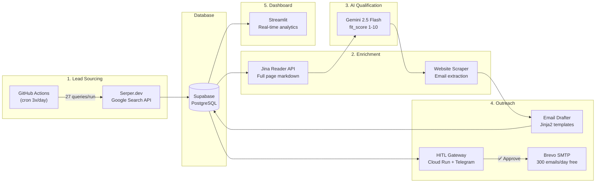
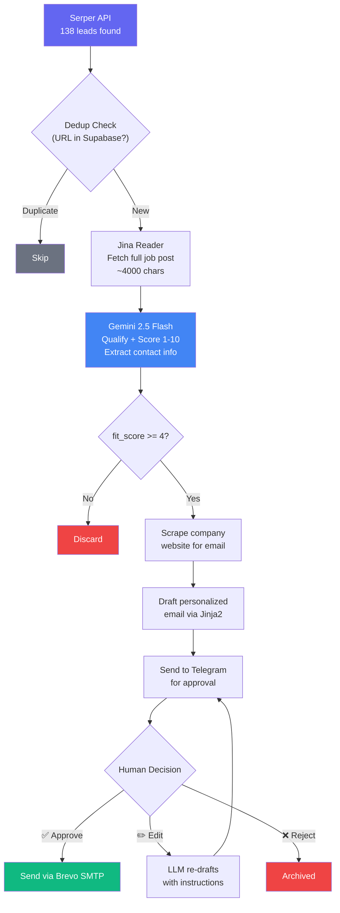
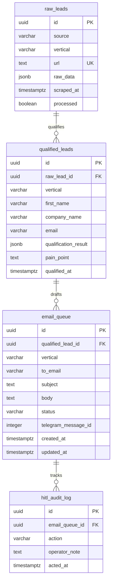

# Autonomous B2B Prospecting Agent

**Fully automated lead generation, qualification, and outreach pipeline — $0 operational cost.**

An AI-powered prospecting system that autonomously discovers job postings, enriches them with full content, qualifies leads using LLM scoring, drafts personalized emails, and routes them through a human-in-the-loop approval flow via Telegram — all running on free-tier infrastructure.

[](https://python.org)
[](https://ai.google.dev)
[](https://supabase.com)
[](https://streamlit.io)
[](https://cloud.google.com/run)

---

## Architecture



## Pipeline Flow



## Key Features

### Intelligent Lead Sourcing
- **4 job boards** searched simultaneously: Upwork, LinkedIn, WeWorkRemotely, Indeed
- **Portfolio-aligned keywords**: financial modeling, Monte Carlo simulation, demand forecasting, dashboard development, Streamlit, and more
- **A/B keyword rotation** to stay within API free tiers (pool A on even runs, pool B on odd)
- **Freshness filter** (`tbs:qdr:w`): only jobs posted in the last 7 days

### Content Enrichment
- **Jina Reader API** converts job URLs into clean markdown (~4,000 chars) for deep qualification
- **Company website scraping** discovers real email addresses via `mailto:` links and regex patterns
- **Contact extraction**: Gemini identifies hiring manager names from full job descriptions
- **Best-effort design**: enrichment failures never break the pipeline — graceful degradation to snippet data

### AI-Powered Qualification
- **Gemini 2.5 Flash-Lite** scores each lead on a 1-10 fit scale against the freelancer's portfolio
- Extracts structured data: `pain_point`, `portfolio_proof`, `suggested_angle`, `contact_name`, `company_website`, `budget_estimate`
- **5 outreach angles**: ROI-focused, Time-saving, Technical architecture, Risk-reduction, Revenue-uplift
- Leads scoring below 4/10 are automatically discarded

### Human-in-the-Loop (HITL)
- **Telegram bot** sends each email draft with Approve / Edit / Reject buttons
- **Edit flow**: operator sends natural language instructions → Gemini re-drafts the email
- **Full audit trail** in `hitl_audit_log` table
- **Dashboard alternative**: approve/reject directly from the Streamlit web interface

### Real-Time Dashboard
- **Overview**: KPIs, pipeline funnel, fit score distribution, daily trends
- **Leads Explorer**: filterable table with expandable qualification details
- **Email Queue**: view drafts, approve/reject from browser, email preview
- **Analytics**: conversion rates by source, keyword performance, timeline charts

## Tech Stack

| Component | Service | Purpose | Cost |
|---|---|---|---|
| **Orchestration** | GitHub Actions | Cron jobs (3x/day) | Free (2,000 min/mo) |
| **Search API** | Serper.dev | Google Search queries | Free (2,500/mo) |
| **Enrichment** | Jina Reader | URL → markdown conversion | Free (100 RPM) |
| **LLM** | Gemini 2.5 Flash-Lite | Lead qualification + scoring | ~$0.50/mo |
| **Database** | Supabase | PostgreSQL + REST API | Free (500MB) |
| **HITL Gateway** | Google Cloud Run | Telegram webhook + email API | Free (2M req/mo) |
| **Email** | Brevo SMTP | Transactional email delivery | Free (300/day) |
| **Dashboard** | Streamlit Cloud | Real-time analytics UI | Free |
| **Bot** | Telegram Bot API | Approval notifications | Free |
| | | **Total monthly cost** | **~$0.50** |

## Database Schema



## Project Structure

```
prospecting-agent/
├── .github/workflows/
│   ├── vertical1_scraper.yml       # Cron: every 8 hours (Tech)
│   └── vertical2_scraper.yml       # Cron: every 6-8 hours (Cerrieta)
│
├── services/
│   ├── vertical1_tech/             # Tech Services pipeline
│   │   └── src/
│   │       ├── main.py             # Pipeline orchestrator
│   │       ├── qualifier.py        # Gemini qualification (fit_score 1-10)
│   │       ├── email_drafter.py    # Jinja2 email templates
│   │       ├── db_client.py        # Supabase async repository
│   │       └── scrapers/
│   │           └── serper_search.py  # Serper API search (4 job boards)
│   │
│   ├── vertical2_cerrieta/         # Luxury Pet Furniture pipeline
│   │   └── src/
│   │       ├── main.py
│   │       ├── qualifier.py
│   │       ├── email_drafter.py
│   │       ├── db_client.py
│   │       └── scrapers/
│   │           ├── serper_search.py  # Instagram via Google Search
│   │           └── gmaps_scraper.py  # Google Places API
│   │
│   └── hitl_gateway/               # Cloud Run: approval flow
│       ├── src/
│       │   ├── main.py             # FastAPI app (/notify, /webhook)
│       │   ├── approval_router.py  # State machine: pending→approved→sent
│       │   ├── telegram_bot.py     # Telegram inline keyboards
│       │   ├── email_sender.py     # Brevo SMTP async client
│       │   └── db_client.py        # Supabase operations
│       └── Dockerfile
│
├── shared/
│   ├── prompts/
│   │   ├── vertical1_system_prompt.txt  # Tech qualification rubric
│   │   └── vertical2_system_prompt.txt  # Cerrieta qualification rubric
│   └── utils/
│       ├── content_enricher.py     # Jina Reader + email scraping
│       ├── serper_client.py        # Serper.dev API wrapper
│       └── rate_limiter.py         # Token-bucket rate limiters
│
├── dashboard/                      # Streamlit analytics UI
│   ├── app.py                      # Entry point + navigation
│   ├── pages/
│   │   ├── 1_overview.py           # KPIs, funnel, trends
│   │   ├── 2_leads.py             # Filterable leads table
│   │   ├── 3_email_queue.py       # HITL approve/reject
│   │   └── 4_analytics.py         # Source performance charts
│   └── utils/
│       ├── supabase_client.py     # Cached Supabase queries
│       └── helpers.py             # Formatters, color maps
│
├── supabase/migrations/
│   └── 001_initial_schema.sql      # PostgreSQL schema
│
├── .env.example
└── README.md
```

## Setup

### Prerequisites

- Python 3.12+
- GitHub account (for Actions)
- `gcloud` CLI (for Cloud Run deployment)

### 1. Database (Supabase)

1. Create a project at [supabase.com](https://supabase.com) (free tier)
2. Go to SQL Editor → run `supabase/migrations/001_initial_schema.sql`
3. Copy `Project URL` and `service_role` key from Settings → API

### 2. Gemini API Key

1. Go to [aistudio.google.com/app/apikey](https://aistudio.google.com/app/apikey)
2. Create API Key → enable billing for higher rate limits ($5 lasts ~10 months)

### 3. Search APIs

- **Serper.dev**: Free at [serper.dev](https://serper.dev) (2,500 queries/month, no credit card)
- **Jina Reader**: Free at [jina.ai](https://jina.ai/reader) (100 RPM)

### 4. Telegram Bot

1. Message [@BotFather](https://t.me/BotFather) → `/newbot` → save token
2. Message [@userinfobot](https://t.me/userinfobot) → save your `chat_id`

### 5. Email (Brevo SMTP)

1. Create account at [brevo.com](https://brevo.com) (free: 300 emails/day)
2. SMTP & API → Generate SMTP key
3. Configure DNS records (SPF, DKIM, DMARC) for your sending domain

### 6. HITL Gateway (Cloud Run)

```bash
cd services/hitl_gateway
gcloud run deploy hitl-gateway \
  --source . \
  --region us-central1 \
  --allow-unauthenticated \
  --set-env-vars="SUPABASE_URL=...,SUPABASE_KEY=...,..."
```

### 7. GitHub Actions Secrets

Add these in your repo → Settings → Secrets → Actions:

`SUPABASE_URL`, `SUPABASE_SERVICE_KEY`, `GEMINI_API_KEY`, `TELEGRAM_BOT_TOKEN`, `TELEGRAM_CHAT_ID`, `HITL_GATEWAY_URL`, `BREVO_SMTP_PASSWORD`, `GOOGLE_PLACES_API_KEY`, `SERPER_API_KEY`, `JINA_API_KEY`

### 8. Dashboard (Streamlit)

```bash
# Local
cd dashboard
streamlit run app.py

# Cloud: deploy at share.streamlit.io → point to dashboard/app.py
```

## Local Development

```bash
cp .env.example .env
# Edit .env with your credentials

pip install -r services/vertical1_tech/requirements.txt

# Run Tech pipeline
python -m services.vertical1_tech.src.main --source all

# Run dashboard
cd dashboard && streamlit run app.py
```

## Design Decisions

| Decision | Rationale |
|---|---|
| **Serper.dev over direct scraping** | Google already indexed job boards — no IP blocking, no Selenium, no maintenance |
| **Jina Reader for enrichment** | Converts any URL to clean markdown; free tier is generous (100 RPM) |
| **Gemini over GPT-4** | Free tier for prototyping; 2.5 Flash-Lite is fast and cheap for structured extraction |
| **fit_score 1-10 over binary YES/NO** | Granular scoring enables prioritization — score 9 financial models get attention before score 5 generic jobs |
| **Telegram HITL over auto-send** | Cold outreach needs human judgment; Telegram is instant and mobile-friendly |
| **A/B keyword pools** | Rotates keywords each run to maximize coverage within API free tiers |
| **Best-effort enrichment** | Jina/scraping failures never block the pipeline — graceful degradation to snippet data |
| **Async everywhere** | `asyncio` + `httpx` + `aiosmtplib` for maximum throughput on free-tier rate limits |

## Performance Metrics

| Metric | Value |
|---|---|
| Leads discovered per run | ~138 |
| Leads processed per run | 30 (configurable) |
| Enrichment success rate | ~95% |
| Qualification time per lead | ~1-2 seconds |
| Full pipeline execution | ~30 seconds |
| Email with real contact name | ~40% of qualified leads |
| Email with scraped address | ~15% of qualified leads |
| Monthly API cost | ~$0.50 (Gemini only) |

---

Built with Python, Gemini AI, and free-tier infrastructure.
